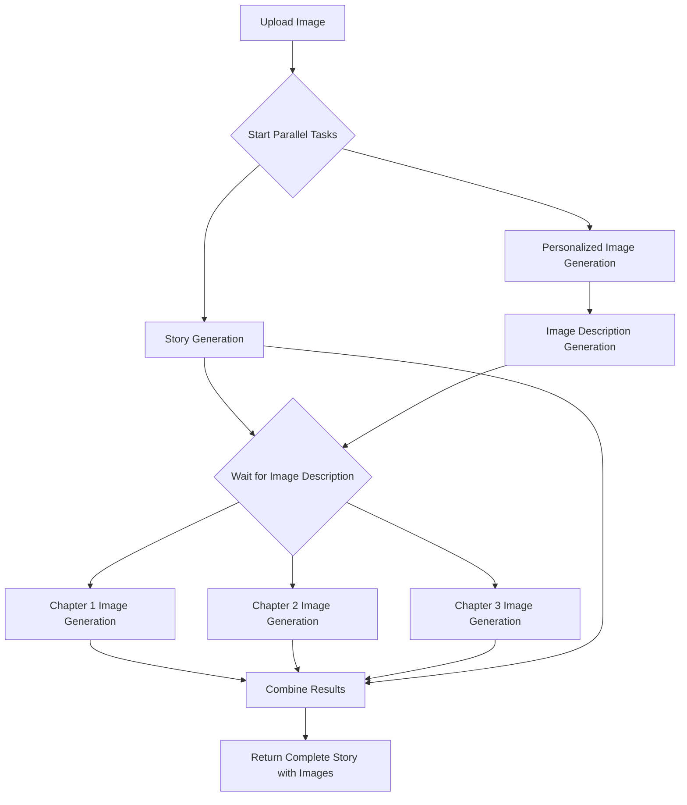

# Image Generation Pipeline Implementation Plan

## Current Status Analysis

### What's Already Implemented
- [x] **Story Generation**: The application can generate 3-chapter stories based on an uploaded image using either:
   - [x] Ollama with LLaVA model
   - [x] Google Generative AI (Gemini)
- [x] **Image Abstraction**: There's a placeholder [generateImageForChapter](file:///Users/jonatassouza/Repositories/personal/snapptale/src/lib/ai/image.ts#L9-L14) function that currently returns a placeholder image
- [x] **API Structure**: 
   - [x] Upload API endpoint at `/api/upload` that receives image and name
   - [x] Story generation happens synchronously after upload
- [x] **Testing**: Comprehensive test suite with mocks for AI services

## Baby Step 1: Create Basic Image Description Generation Function

### Goal: Create a function that can be called to generate image descriptions

**Baby Step 1 - Red Phase**:
1. Add a simple test that calls [generateImageDescription](file:///Users/jonatassouza/Repositories/personal/snapptale/src/lib/ai/image.ts#L34-L42) with a parameter in [tests/ai/image.test.ts](file:///Users/jonatassouza/Repositories/personal/snapptale/tests/ai/image.test.ts)
2. Run the test and verify it fails because the [generateImageDescription](file:///Users/jonatassouza/Repositories/personal/snapptale/src/lib/ai/image.ts#L34-L42) function doesn't exist

**Baby Step 2 - Green Phase**:
1. Implement the minimal [generateImageDescription](file:///Users/jonatassouza/Repositories/personal/snapptale/src/lib/ai/image.ts#L34-L42) function in [src/lib/ai/image.ts](file:///Users/jonatassouza/Repositories/personal/snapptale/src/lib/ai/image.ts) that returns a hardcoded string
2. Run the test and verify it passes

**Baby Step 3 - Document and Commit**:
1. Update documentation
2. Commit changes

## Baby Step 2: Add Return Type Validation for Image Description

### Goal: Ensure the image description function returns the correct data type

**Baby Step 1 - Red Phase**:
1. Add a test that verifies [generateImageDescription](file:///Users/jonatassouza/Repositories/personal/snapptale/src/lib/ai/image.ts#L34-L42) returns a string in [tests/ai/image.test.ts](file:///Users/jonatassouza/Repositories/personal/snapptale/tests/ai/image.test.ts)
2. Run the test and verify it passes (our current implementation already returns a string)

**Baby Step 2 - Document and Commit**:
1. Update documentation
2. Commit changes

## Baby Step 3: Create Basic Personalized Image Generation Function

### Goal: Create a function that can generate personalized images

**Baby Step 1 - Red Phase**:
1. Add a simple test that calls [generatePersonalizedImage](file:///Users/jonatassouza/Repositories/personal/snapptale/src/lib/ai/image.ts#L44-L53) with a parameter in [tests/ai/image.test.ts](file:///Users/jonatassouza/Repositories/personal/snapptale/tests/ai/image.test.ts)
2. Run the test and verify it fails because the [generatePersonalizedImage](file:///Users/jonatassouza/Repositories/personal/snapptale/src/lib/ai/image.ts#L44-L53) function doesn't exist

**Baby Step 2 - Green Phase**:
1. Implement the minimal [generatePersonalizedImage](file:///Users/jonatassouza/Repositories/personal/snapptale/src/lib/ai/image.ts#L44-L53) function in [src/lib/ai/image.ts](file:///Users/jonatassouza/Repositories/personal/snapptale/src/lib/ai/image.ts) that returns a hardcoded string
2. Run the test and verify it passes

**Baby Step 3 - Document and Commit**:
1. Update documentation
2. Commit changes

## Baby Step 4: Add Return Format Validation for Personalized Image

### Goal: Ensure the personalized image function returns a base64 data URL

**Baby Step 1 - Red Phase**:
1. Add a test that verifies [generatePersonalizedImage](file:///Users/jonatassouza/Repositories/personal/snapptale/src/lib/ai/image.ts#L44-L53) returns a base64 data URL format in [tests/ai/image.test.ts](file:///Users/jonatassouza/Repositories/personal/snapptale/tests/ai/image.test.ts)
2. Run the test and verify it fails because our current implementation returns a plain string, not a base64 data URL

**Baby Step 2 - Green Phase**:
1. Update the [generatePersonalizedImage](file:///Users/jonatassouza/Repositories/personal/snapptale/src/lib/ai/image.ts#L44-L53) function in [src/lib/ai/image.ts](file:///Users/jonatassouza/Repositories/personal/snapptale/src/lib/ai/image.ts) to return a base64 data URL format
2. Run the test and verify it passes

**Baby Step 3 - Document and Commit**:
1. Update documentation
2. Commit changes

## Baby Step 5: Update Chapter Image Generation Function Format

### Goal: Ensure [generateImageForChapter](file:///Users/jonatassouza/Repositories/personal/snapptale/src/lib/ai/image.ts#L9-L14) returns images in the correct format

**Baby Step 1 - Red Phase**:
1. Add a test that verifies [generateImageForChapter](file:///Users/jonatassouza/Repositories/personal/snapptale/src/lib/ai/image.ts#L9-L14) returns a base64 data URL format in [tests/ai/image.test.ts](file:///Users/jonatassouza/Repositories/personal/snapptale/tests/ai/image.test.ts)
2. Run the test and verify it fails because our current implementation doesn't return the correct format

**Baby Step 2 - Green Phase**:
1. Update the [generateImageForChapter](file:///Users/jonatassouza/Repositories/personal/snapptale/src/lib/ai/image.ts#L9-L14) function in [src/lib/ai/image.ts](file:///Users/jonatassouza/Repositories/personal/snapptale/src/lib/ai/image.ts) to return a base64 data URL
2. Run the test and verify it passes

**Baby Step 3 - Document and Commit**:
1. Update documentation
2. Commit changes

## Baby Step 6: Create Basic Image Processing Pipeline Function

### Goal: Create the basic image processing pipeline function

**Baby Step 1 - Red Phase**:
1. Add a simple test that calls [processImagePipeline](file:///Users/jonatassouza/Repositories/personal/snapptale/tests/ai/imagePipeline.test.ts#L28-L28) with basic parameters in [tests/ai/imagePipeline.test.ts](file:///Users/jonatassouza/Repositories/personal/snapptale/tests/ai/imagePipeline.test.ts)
2. Run the test and verify it fails because the [processImagePipeline](file:///Users/jonatassouza/Repositories/personal/snapptale/tests/ai/imagePipeline.test.ts#L28-L28) function doesn't exist

**Baby Step 2 - Green Phase**:
1. Create [src/lib/ai/imagePipeline.ts](file:///Users/jonatassouza/Repositories/personal/snapptale/src/lib/ai/imagePipeline.ts)
2. Implement the minimal [processImagePipeline](file:///Users/jonatassouza/Repositories/personal/snapptale/tests/ai/imagePipeline.test.ts#L28-L28) function that returns a basic structure
3. Run the test and verify it passes

**Baby Step 3 - Document and Commit**:
1. Update documentation
2. Commit changes

## Baby Step 7: Add Return Structure Validation for Pipeline

### Goal: Ensure the pipeline function returns the expected structure

**Baby Step 1 - Red Phase**:
1. Add a test that verifies [processImagePipeline](file:///Users/jonatassouza/Repositories/personal/snapptale/tests/ai/imagePipeline.test.ts#L28-L28) returns a structure with story and images in [tests/ai/imagePipeline.test.ts](file:///Users/jonatassouza/Repositories/personal/snapptale/tests/ai/imagePipeline.test.ts)
2. Run the test and verify it fails because our current implementation doesn't return the expected structure

**Baby Step 2 - Green Phase**:
1. Update the [processImagePipeline](file:///Users/jonatassouza/Repositories/personal/snapptale/tests/ai/imagePipeline.test.ts#L28-L28) function in [src/lib/ai/imagePipeline.ts](file:///Users/jonatassouza/Repositories/personal/snapptale/src/lib/ai/imagePipeline.ts) to return the expected structure
2. Run the test and verify it passes

**Baby Step 3 - Document and Commit**:
1. Update documentation
2. Commit changes

## Current Implementation Status

### Completed Baby Steps:
- [x] Baby Step 1: Create Basic Image Description Generation Function
- [x] Baby Step 2: Add Return Type Validation for Image Description
- [x] Baby Step 3: Create Basic Personalized Image Generation Function
- [x] Baby Step 4: Add Return Format Validation for Personalized Image
- [x] Baby Step 5: Update Chapter Image Generation Function Format
- [x] Baby Step 6: Create Basic Image Processing Pipeline Function
- [x] Baby Step 7: Add Return Structure Validation for Pipeline

### In Progress Baby Steps:
- [ ] Baby Step 8: Implement Sequential Image Processing Pipeline Logic
- [ ] Baby Step 9: Add Parallel Processing to Image Pipeline
- [ ] Baby Step 10: Update API Endpoint to Use New Pipeline
- [ ] Baby Step 11: Implement Image Description with Google AI
- [ ] Baby Step 12: Implement Personalized Image Generation with Google AI
- [ ] Baby Step 13: Implement Chapter Image Generation with Google AI

## File Structure Changes

```
src/
  lib/
    ai/
      index.ts          # Existing story generation
      image.ts          # Enhanced image generation functions
      imagePipeline.ts  # New pipeline orchestration (in progress)
      prompts.ts        # Existing prompts (may need updates)
  app/
    api/
      upload/
        route.ts        # Updated to use new pipeline
tests/
  ai/
    image.test.ts       # New tests for image functions
    imagePipeline.test.ts # New tests for pipeline
  api/
    upload.test.ts      # Updated tests for API endpoint
```

## Parallel Processing Architecture



## Environment Considerations

- [ ] **Google AI API Keys**: Ensure proper configuration in [.env.local](file:///Users/jonatassouza/Repositories/personal/snapptale/.env.local)
- [ ] **Rate Limiting**: Implement proper rate limiting for AI services
- [ ] **Error Handling**: Comprehensive error handling for all AI service calls
- [ ] **Timeouts**: Appropriate timeouts for long-running AI operations

## Testing Strategy

- [x] **Unit Tests**: Test each function in isolation with mocks
- [x] **Pipeline Test**: Test for the planned pipeline exists
- [ ] **Integration Tests**: Test the complete pipeline with mocked AI services
- [ ] **API Tests**: Test the complete flow through the API endpoint
- [ ] **Error Tests**: Test error conditions and edge cases
- [ ] **Performance Tests**: Test parallel processing performance

## Success Criteria

### Functional
- [ ] Personalized image generated from uploaded photo
- [ ] Image description identifies main character
- [ ] Chapter-specific images generated
- [ ] All images properly integrated into story

### Performance
- [ ] Parallel processing reduces overall generation time
- [ ] Proper error handling without blocking
- [ ] Efficient resource usage

### Reliability
- [x] All tests pass
- [ ] Error handling for AI service failures
- [ ] Graceful degradation when services are unavailable

### Maintainability
- [x] Clear code structure
- [x] Comprehensive test coverage
- [ ] Good documentation

## Alignment with Project Principles

This implementation plan adheres to the core principles outlined in [prepare-chat-prompt.md](file:///Users/jonatassouza/Repositories/personal/snapptale/.gemini/prepare-chat-prompt.md) and [GEMINI.md](file:///Users/jonatassouza/Repositories/personal/snapptale/GEMINI.md):

1. **Confirm Significant Actions**: All significant changes will require explicit user permission before implementation.
2. **Adhere to Project Conventions**: All modifications will strictly follow existing project conventions.
3. **Test-Driven Approach**: Following the strict TDD baby steps for all new features.
4. **User Control**: Implementation will not proceed beyond the clear scope of user requests without confirmation.
5. **Documentation Accuracy**: Documentation will reflect only what is actually implemented.