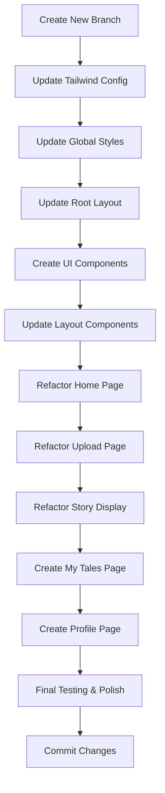

# UX Refactoring Plan

This document outlines the steps needed to refactor the current Snaptale application to align with the new UX patterns defined in the `.gemini/new-ux` directory.

## Current State Analysis

### Existing Components & Structure
1. **Pages**:
   - Home page (`src/app/page.tsx`)
   - Upload page (`src/app/upload/page.tsx`)
   - API route (`src/app/api/upload/route.ts`)

2. **Components**:
   - StorybookPreview (`src/components/StorybookPreview.tsx`)
   - Layout components: Header (`src/components/layout/Header.tsx`), Footer (`src/components/layout/Footer.tsx`)
   - Custom hooks: useFilePreview, usePdfExporter

3. **Styling**:
   - Tailwind CSS with custom color palette
   - Poppins and Nunito fonts from @fontsource
   - Custom color variables in tailwind.config.js

### New UX Patterns Analysis

#### 01-photo_upload_&_name_input
- Modern mobile-first design with bottom navigation
- Plus Jakarta Sans font family
- New color scheme (primary: #13a4ec, background-light: #f6f7f8, background-dark: #101c22)
- Enhanced photo upload experience with visual preview
- Improved form inputs with better spacing and styling
- Consistent header and footer navigation

#### 02-ai_story_&_illustration_generation
- Story display with chapter-based layout
- Material Symbols for icons
- Better image presentation with rounded corners and aspect ratios
- Improved typography hierarchy
- Download button with icon
- Consistent navigation bar at bottom

#### my_tales_collection
- Card-based layout for story collections
- Consistent styling with rounded corners
- Delete functionality for stories
- Material Symbols icons

#### user_profile_&_settings
- Profile display with avatar
- Account and settings sections
- Material Symbols icons
- Logout functionality

## Refactoring Goals

1. Update the overall design language to match the new UX patterns
2. Implement a consistent color scheme and typography
3. Improve the user flow from photo upload to story generation
4. Enhance the story presentation with better visual hierarchy
5. Implement consistent navigation across all screens
6. Create reusable components for consistent UI

## Implementation Plan

### Phase 1: Foundation & Global Styles

- [ ] Update Tailwind configuration with new color palette
- [ ] Update font configuration to use Plus Jakarta Sans
- [ ] Implement dark mode support
- [ ] Create shared layout components (Header, Footer/Navigation)
- [ ] Update global CSS with new design tokens
- [ ] Add Material Symbols font

### Phase 2: Home Page Refactor

- [ ] Redesign home page with new visual identity
- [ ] Implement new header with back button
- [ ] Update hero section with improved typography
- [ ] Add consistent footer navigation

### Phase 3: Upload Page Refactor

- [ ] Redesign photo upload section with visual preview
- [ ] Implement new styling for name input field
- [ ] Update generate button with new design
- [ ] Add loading state with progress indicator
- [ ] Implement error handling with new styling

### Phase 4: Story Display Refactor

- [ ] Redesign story presentation with chapter-based layout
- [ ] Improve image display with consistent styling
- [ ] Update typography for better readability
- [ ] Add download button with icon
- [ ] Implement smooth scrolling to story section

### Phase 5: New Components & Features

- [ ] Create reusable Button component
- [ ] Create reusable Input component
- [ ] Create reusable Card component for story chapters
- [ ] Implement consistent icon system using Material Symbols
- [ ] Add proper loading states and animations

### Phase 6: Additional Pages Implementation

- [ ] Create "My Tales" page with card-based layout
- [ ] Create "Profile" page with account settings
- [ ] Implement navigation between all pages

### Phase 7: Testing & Polish

- [ ] Test responsive design across different screen sizes
- [ ] Verify dark mode implementation
- [ ] Check accessibility compliance
- [ ] Optimize performance
- [ ] Conduct final visual review

## New Color Palette

```js
{
  "primary": "#13a4ec",
  "background-light": "#f6f7f8",
  "background-dark": "#101c22",
  // Existing colors for reference
  "snaptale-primary": "#A8DADC",
  "snaptale-secondary": "#FFD6BA",
  "snaptale-highlight": "#457B9D",
  "snaptale-shadow": "#1D3557",
  "snaptale-background": "#F9FAFB",
  "snaptale-app-background": "#A8DADC"
}
```

## Typography

- Primary font: Plus Jakarta Sans
- Font weights: 400 (regular), 500 (medium), 700 (bold), 800 (extra bold)

## Component Structure

```
src/
├── components/
│   ├── layout/
│   │   ├── Header.tsx
│   │   ├── Footer.tsx
│   │   └── Navigation.tsx
│   ├── ui/
│   │   ├── Button.tsx
│   │   ├── Input.tsx
│   │   ├── Card.tsx
│   │   └── LoadingSpinner.tsx
│   ├── story/
│   │   ├── StoryChapter.tsx
│   │   └── StoryPreview.tsx
│   └── shared/
│       └── ThemeToggle.tsx
└── app/
    ├── layout.tsx
    ├── page.tsx
    ├── upload/
    │   └── page.tsx
    ├── my-tales/
    │   └── page.tsx
    └── profile/
        └── page.tsx
```

## Detailed Implementation Steps

### 1. Update Tailwind Configuration

- [ ] Add new color palette to `tailwind.config.js`:
  - primary: #13a4ec
  - background-light: #f6f7f8
  - background-dark: #101c22
- [ ] Update font family configuration to use Plus Jakarta Sans
- [ ] Add borderRadius extensions for consistent styling:
  - DEFAULT: 0.5rem
  - lg: 1rem
  - xl: 1.5rem
  - full: 9999px
- [ ] Add dark mode configuration with 'class' strategy

### 2. Update Global Styles

- [ ] Modify `src/app/globals.css` to include Plus Jakarta Sans font
- [ ] Add Material Symbols font
- [ ] Add dark mode CSS variables for new color scheme
- [ ] Update body styles for new background colors
- [ ] Add font-display class for Plus Jakarta Sans

### 3. Create Shared Layout Components

- [ ] Update `Header` component with back button functionality in `src/components/layout/Header.tsx`
- [ ] Update `Footer` component with navigation in `src/components/layout/Footer.tsx`
- [ ] Implement navigation state management with active route detection
- [ ] Create `Navigation` component in `src/components/layout/Navigation.tsx`

### 4. Refactor Home Page

- [ ] Update home page layout to match new design in `src/app/page.tsx`
- [ ] Replace current logo with new styling
- [ ] Update typography with new font family (Plus Jakarta Sans)
- [ ] Add navigation footer with Home (primary), My Tales, and Profile links
- [ ] Implement consistent spacing and padding per new design

### 5. Refactor Upload Page

- [ ] Redesign photo upload section with visual preview in `src/app/upload/page.tsx`
- [ ] Implement new styling for name input field with larger height (h-14) and rounded-lg
- [ ] Update generate button with new design (bg-primary, rounded-xl, h-14)
- [ ] Add loading state with progress indicator and auto-awesome spinner
- [ ] Implement error handling with new styling using alert components
- [ ] Add aspect-[4/3] ratio for image preview container
- [ ] Implement "Change Photo" overlay button

### 6. Refactor Story Display

- [ ] Update `StorybookPreview` component with new styling in `src/components/StorybookPreview.tsx`
- [ ] Implement chapter-based layout with consistent spacing
- [ ] Improve image display with rounded-xl and aspect-[4/3] styling
- [ ] Update typography for better readability with proper text colors for light/dark modes
- [ ] Add download button with icon using Material Symbols
- [ ] Implement smooth scrolling to story section

### 7. Create Reusable UI Components

- [ ] Create `Button` component with primary and secondary variants in `src/components/ui/Button.tsx`
- [ ] Create `Input` component with proper styling in `src/components/ui/Input.tsx`
- [ ] Create `Card` component for story chapters in `src/components/ui/Card.tsx`
- [ ] Create `LoadingSpinner` component in `src/components/ui/LoadingSpinner.tsx`
- [ ] Create `StoryChapter` component in `src/components/story/StoryChapter.tsx`

### 8. Implement Icon System

- [ ] Add Material Symbols font via Google Fonts
- [ ] Create icon components for consistent usage in `src/components/ui/Icon.tsx`
- [ ] Replace existing SVG icons with Material Symbols
- [ ] Implement icon variants for different weights (outlined, filled, rounded)

### 9. Create My Tales Page

- [ ] Create new page at `src/app/my-tales/page.tsx`
- [ ] Implement card-based layout for story collections
- [ ] Add "View Story" and "Delete" buttons for each story
- [ ] Use Material Symbols icons for actions
- [ ] Add navigation footer

### 10. Create Profile Page

- [ ] Create new page at `src/app/profile/page.tsx`
- [ ] Implement profile display with avatar
- [ ] Add account settings section
- [ ] Add settings section with privacy, terms, etc.
- [ ] Add logout functionality
- [ ] Add navigation footer

## Baby Steps Implementation Approach

### Step 1: Setup New Design Foundation
- [ ] Create new branch for UX refactoring
- [ ] Update tailwind.config.js with new color palette
- [ ] Update tailwind.config.js with Plus Jakarta Sans font
- [ ] Update tailwind.config.js with borderRadius extensions
- [ ] Update tailwind.config.js with dark mode configuration
- [ ] Manual check: Verify Tailwind config changes
- [ ] Commit changes

### Step 2: Update Global Styles
- [ ] Update src/app/globals.css to remove old fonts
- [ ] Update src/app/globals.css to add Plus Jakarta Sans
- [ ] Update src/app/globals.css to add Material Symbols
- [ ] Update src/app/globals.css with new background colors
- [ ] Manual check: Verify font loading in browser
- [ ] Manual check: Verify color variables
- [ ] Commit changes

### Step 3: Update Root Layout
- [ ] Update src/app/layout.tsx to use Plus Jakarta Sans
- [ ] Remove old Geist fonts
- [ ] Manual check: Verify font changes in app
- [ ] Commit changes

### Step 4: Create New UI Components
- [ ] Create src/components/ui/Button.tsx with primary/secondary variants
- [ ] Create src/components/ui/Input.tsx with new styling
- [ ] Create src/components/ui/Card.tsx with new styling
- [ ] Create src/components/ui/LoadingSpinner.tsx
- [ ] Manual check: Verify component styling
- [ ] Commit changes

### Step 5: Update Layout Components
- [ ] Update src/components/layout/Header.tsx with new styling
- [ ] Update src/components/layout/Footer.tsx with new styling
- [ ] Manual check: Verify header/footer styling
- [ ] Manual check: Verify dark mode support
- [ ] Commit changes

### Step 6: Refactor Home Page
- [ ] Update src/app/page.tsx with new design
- [ ] Replace old fonts with Plus Jakarta Sans
- [ ] Update color scheme
- [ ] Add new header component
- [ ] Add new footer component
- [ ] Manual check: Verify home page design
- [ ] Manual check: Verify responsive design
- [ ] Manual check: Verify dark mode
- [ ] Commit changes

### Step 7: Refactor Upload Page - Part 1
- [ ] Update src/app/upload/page.tsx structure
- [ ] Replace file input with visual preview area
- [ ] Add image preview container with aspect-[4/3]
- [ ] Manual check: Verify image preview area
- [ ] Commit changes

### Step 8: Refactor Upload Page - Part 2
- [ ] Update name input field with new styling
- [ ] Update generate button with new design
- [ ] Add new header component
- [ ] Add new footer component
- [ ] Manual check: Verify form styling
- [ ] Manual check: Verify responsive design
- [ ] Manual check: Verify dark mode
- [ ] Commit changes

### Step 9: Refactor Upload Page - Part 3
- [ ] Add loading state with progress indicator
- [ ] Add error handling with new styling
- [ ] Implement "Change Photo" overlay button
- [ ] Manual check: Verify loading state
- [ ] Manual check: Verify error handling
- [ ] Commit changes

### Step 10: Refactor Story Display - Part 1
- [ ] Update src/components/StorybookPreview.tsx structure
- [ ] Implement chapter-based layout
- [ ] Update image display with rounded-xl and aspect-[4/3]
- [ ] Manual check: Verify chapter layout
- [ ] Commit changes

### Step 11: Refactor Story Display - Part 2
- [ ] Update typography with new styling
- [ ] Add download button with Material Symbols icon
- [ ] Implement smooth scrolling
- [ ] Manual check: Verify typography
- [ ] Manual check: Verify download button
- [ ] Commit changes

### Step 12: Create My Tales Page
- [ ] Create src/app/my-tales/page.tsx
- [ ] Implement card-based layout
- [ ] Add "View Story" and "Delete" buttons
- [ ] Add header and footer components
- [ ] Manual check: Verify page layout
- [ ] Manual check: Verify responsive design
- [ ] Commit changes

### Step 13: Create Profile Page
- [ ] Create src/app/profile/page.tsx
- [ ] Implement profile display with avatar
- [ ] Add account and settings sections
- [ ] Add logout functionality
- [ ] Add header and footer components
- [ ] Manual check: Verify page layout
- [ ] Manual check: Verify responsive design
- [ ] Commit changes

### Step 14: Final Testing and Polish
- [ ] Test responsive design on all pages
- [ ] Verify dark mode implementation on all pages
- [ ] Check accessibility compliance
- [ ] Optimize performance
- [ ] Conduct final visual review
- [ ] Commit final changes

## Validation Process

After each step, we will:

1. Manually review the UI changes in browser
2. Check responsive design on different screen sizes
3. Verify dark mode implementation
4. Test functionality (form inputs, buttons, navigation)
5. Commit changes only after successful manual validation

## Testing Approach

### Manual Testing
- [ ] Test on multiple devices (mobile, tablet, desktop)
- [ ] Test in different browsers (Chrome, Firefox, Safari, Edge)
- [ ] Test dark mode and light mode
- [ ] Test all user flows (upload photo → generate story → download)
- [ ] Test navigation between all pages
- [ ] Test error states and loading states
- [ ] Test accessibility features (keyboard navigation, screen readers)

### Automated Testing
- [ ] Update existing component tests to reflect new UI
- [ ] Add new tests for created components
- [ ] Run all existing tests to ensure no regressions
- [ ] Add visual regression tests for key components

### Performance Testing
- [ ] Check page load times
- [ ] Verify bundle sizes
- [ ] Test rendering performance
- [ ] Optimize images and assets

## Potential Challenges and Mitigation Strategies

### 1. Font Loading and Performance
**Challenge**: Loading Plus Jakarta Sans and Material Symbols from Google Fonts may impact performance.
**Mitigation**:
- Preload critical fonts
- Use font-display: swap for better loading experience
- Consider self-hosting fonts for production

### 2. Dark Mode Implementation
**Challenge**: Ensuring consistent dark mode across all components and pages.
**Mitigation**:
- Use CSS variables for color theming
- Test dark mode on all pages and components
- Implement a theme toggle component for easy switching

### 3. Responsive Design Consistency
**Challenge**: Maintaining consistent spacing and layout across different screen sizes.
**Mitigation**:
- Use Tailwind's responsive utility classes consistently
- Test on multiple device sizes during development
- Create a design system documentation for spacing and sizing

### 4. Component Reusability
**Challenge**: Creating components that are flexible enough for different use cases.
**Mitigation**:
- Use props to customize component behavior
- Follow React best practices for component composition
- Document component APIs clearly

### 5. Backward Compatibility
**Challenge**: Ensuring existing functionality still works after refactoring.
**Mitigation**:
- Test all existing user flows
- Keep existing functionality intact while improving UI
- Update tests to reflect new UI while maintaining coverage

### 6. Asset Optimization
**Challenge**: Managing image assets and ensuring optimal loading.
**Mitigation**:
- Use Next.js Image component for optimization
- Implement proper aspect ratios for consistent layout
- Optimize images for different screen densities

## Risk Assessment

### High Risk Items
1. **Breaking Existing Functionality**
   - **Risk**: Changes to core components may break existing user flows
   - **Mitigation**: Implement thorough testing strategy with both automated and manual testing
   - **Contingency**: Maintain backup branch with current implementation

2. **Performance Degradation**
   - **Risk**: Additional fonts and assets may slow down page load times
   - **Mitigation**: Optimize assets and implement lazy loading where appropriate
   - **Contingency**: Roll back non-critical visual enhancements if performance drops below threshold

### Medium Risk Items
1. **Cross-Browser Compatibility Issues**
   - **Risk**: New CSS features may not work consistently across all browsers
   - **Mitigation**: Test on all supported browsers during development
   - **Contingency**: Implement fallbacks for unsupported features

2. **Dark Mode Inconsistencies**
   - **Risk**: Some components may not properly adapt to dark mode
   - **Mitigation**: Use CSS variables and thoroughly test all components in both modes
   - **Contingency**: Create a dark mode testing checklist for each component

### Low Risk Items
1. **Design Deviations**
   - **Risk**: Final implementation may deviate from design specifications
   - **Mitigation**: Regular design reviews and reference to original UX patterns
   - **Contingency**: Schedule design validation checkpoints throughout development

2. **Component Naming Conflicts**
   - **Risk**: New component names may conflict with existing ones
   - **Mitigation**: Follow consistent naming conventions and check for conflicts
   - **Contingency**: Rename components if conflicts arise

## Communication Plan

### Internal Communication
- **Daily Standups**: 15-minute daily sync to discuss progress, blockers, and next steps
- **Weekly Reviews**: In-depth review of completed work and planning for upcoming week
- **Design Checkpoints**: Regular design reviews with stakeholders after major milestones
- **Code Reviews**: All changes must be reviewed by at least one other team member before merging

### External Communication
- **Stakeholder Updates**: Bi-weekly progress reports to project stakeholders
- **User Feedback Sessions**: Conduct user testing sessions after major phases
- **Release Announcements**: Communicate new features and improvements to users

### Documentation
- **Code Documentation**: Maintain inline documentation for all new components and functions
- **Design System Documentation**: Create a living document for the design system and component usage
- **Changelog**: Maintain a detailed changelog of all UX improvements

## Timeline and Resource Allocation

### Estimated Timeline
- **Phase 1: Foundation & Global Styles** - 2 days
- **Phase 2: Home Page Refactor** - 1 day
- **Phase 3: Upload Page Refactor** - 2 days
- **Phase 4: Story Display Refactor** - 2 days
- **Phase 5: New Components & Features** - 3 days
- **Phase 6: Additional Pages Implementation** - 2 days
- **Phase 7: Testing & Polish** - 2 days

**Total estimated time: 14 days**

### Resource Requirements
- **Frontend Developer**: 1 senior React/Next.js developer
- **Designer**: For design validation and feedback (part-time)
- **QA Engineer**: For testing across devices and browsers (part-time)
- **Tools**: 
  - Modern code editor (VS Code recommended)
  - Browser developer tools
  - Design tools for reference (Figma files from .gemini/new-ux)

## Success Metrics and KPIs

### User Experience Metrics
- **Task Completion Rate**: Target >95% success rate for core user flows (upload → generate → download)
- **Time on Task**: Reduce average time to complete story generation by 20%
- **User Satisfaction Score**: Achieve >4.5/5 rating in user feedback surveys
- **Bounce Rate**: Reduce bounce rate on upload page by 15%

### Technical Metrics
- **Page Load Time**: Achieve <2 seconds load time on 3G connection
- **First Contentful Paint**: <1.5 seconds on average
- **Cumulative Layout Shift**: <0.1 for all pages
- **Bundle Size**: Maintain or reduce overall bundle size

### Accessibility Metrics
- **WCAG Compliance**: Achieve AA level compliance across all pages
- **Screen Reader Compatibility**: 100% compatibility with major screen readers
- **Keyboard Navigation**: Full keyboard accessibility for all interactive elements

### Code Quality Metrics
- **Component Reusability**: >80% of UI elements as reusable components
- **Test Coverage**: Maintain >85% test coverage for UI components
- **Code Consistency**: Zero linting errors after refactoring

## Implementation Checklist

### Design Consistency
- [ ] All pages use Plus Jakarta Sans font
- [ ] Color scheme matches new palette (primary: #13a4ec)
- [ ] Consistent spacing and padding across components
- [ ] Rounded corners match defined borderRadius values
- [ ] Header and footer navigation present on all pages

### Component Implementation
- [ ] Photo upload area matches new design
- [ ] Input fields have proper styling (h-14, rounded-lg)
- [ ] Buttons use new design (bg-primary, rounded-xl)
- [ ] Story chapters display in card layout
- [ ] Images have consistent aspect ratio (4/3) and rounded corners
- [ ] Download button includes Material Symbols icon

### Functionality
- [ ] Photo upload and preview work correctly
- [ ] Form validation works as expected
- [ ] Story generation flow is maintained
- [ ] PDF export functionality still works
- [ ] Navigation between pages works correctly
- [ ] Loading states display properly
- [ ] Error handling shows appropriate messages

### Responsive Design
- [ ] Layout works on mobile devices
- [ ] Layout works on tablet devices
- [ ] Layout works on desktop devices
- [ ] Text sizes are appropriate for each device
- [ ] Spacing adjusts appropriately for different screen sizes

## Specific Component Changes

### Current Home Page (`src/app/page.tsx`) → New Design
- [ ] Replace Poppins/Nunito fonts with Plus Jakarta Sans
- [ ] Update color scheme from snaptale-app-background to background-light
- [ ] Add header with back button (arrow_back icon)
- [ ] Add footer navigation with Home (primary), My Tales, and Profile
- [ ] Update button styling to match new primary color and rounded-xl
- [ ] Improve spacing and typography hierarchy
- [ ] Add hero text "Your Story, Your Adventure"

### Current Upload Page (`src/app/upload/page.tsx`) → New Design
- [ ] Replace file input with visual photo upload area
- [ ] Add image preview with overlay "Change Photo" button
- [ ] Update input field styling to match new design (h-14, rounded-lg, bg-gray-200)
- [ ] Update generate button to new design (bg-primary, rounded-xl, h-14)
- [ ] Add loading state with progress indicator
- [ ] Add error handling with new styling
- [ ] Implement aspect-[4/3] ratio for image container
- [ ] Add header and footer navigation
- [ ] Remove form tag and use div instead for cleaner layout

### Current StorybookPreview (`src/components/StorybookPreview.tsx`) → New Design
- [ ] Redesign chapter layout with consistent spacing
- [ ] Update image display with rounded-xl and aspect-[4/3]
- [ ] Improve typography with better text colors for light/dark modes
- [ ] Add download button with icon using Material Symbols
- [ ] Implement card-based design for each chapter
- [ ] Add chapter title styling with bold text
- [ ] Add consistent padding and margins

### New My Tales Page (`src/app/my-tales/page.tsx`)
- [ ] Implement card-based layout for story collections
- [ ] Add "View Story" and "Delete" buttons for each story
- [ ] Use Material Symbols icons for actions
- [ ] Add navigation footer
- [ ] Add header with back button
- [ ] Implement consistent card styling with rounded corners
- [ ] Add story creation date

### New Profile Page (`src/app/profile/page.tsx`)
- [ ] Implement profile display with avatar
- [ ] Add account settings section
- [ ] Add settings section with privacy, terms, etc.
- [ ] Add logout functionality
- [ ] Add navigation footer
- [ ] Add header with back button
- [ ] Implement consistent section styling
- [ ] Add user name and premium status

## Component Design Specifications

### Header Component
- Height: 64px (p-4 padding)
- Back button: Material Symbols arrow_back icon
- Title: Centered, font-bold, text-lg
- Background: background-light/80 with backdrop-blur-sm
- Dark mode: background-dark/80

### Footer/Navigation Component
- Fixed at bottom of screen
- Background: background-light/90 with backdrop-blur-sm
- Dark mode: background-dark/90
- Border top: 1px solid slate-200 (light) / slate-800 (dark)
- Three navigation items: Home, My Tales, Profile
- Active state: primary color with filled icon
- Inactive state: slate-500 with outlined icon

### Button Component
- Primary variant:
  - Background: primary (#13a4ec)
  - Text: white
  - Height: h-14 for main buttons, py-3 for secondary
  - Rounded: rounded-xl for main, rounded-lg for secondary
  - Font: font-bold
  - Hover: bg-primary/90
- Secondary variant:
  - Background: primary/10 (light) or primary/20 (dark)
  - Text: primary
  - Height: h-12
  - Rounded: rounded-lg
  - Font: font-bold

### Input Component
- Height: h-14
- Rounded: rounded-lg
- Background: bg-gray-200 (light) / bg-gray-800 (dark)
- Border: none
- Focus ring: ring-2 ring-primary
- Text: text-gray-900 (light) / text-white (dark)
- Placeholder: text-gray-500 (light) / text-gray-400 (dark)

### Card Component
- Background: white (light) / background-dark/50 (dark)
- Rounded: rounded-xl
- Shadow: shadow-sm
- Padding: p-4
- Border: border-b border-background-light/50 (light) / border-white/10 (dark) between items

### Story Chapter Component
- Image:
  - Width: full
  - Aspect ratio: 4/3
  - Rounded: rounded-xl
  - Object fit: cover
- Title:
  - Font: text-lg font-bold
  - Color: text-slate-900 (light) / text-white (dark)
- Text:
  - Font: text-base leading-relaxed
  - Color: text-slate-700 (light) / text-slate-300 (dark)
  - Margin top: mt-2

### Loading State
- Progress bar:
  - Full width
  - Height: h-2
  - Background: primary/20
  - Rounded: rounded-full
  - Overflow: hidden
- Progress indicator:
  - Background: primary
  - Rounded: rounded-full
  - Animated: animate-pulse
- Text:
  - Icon: Material Symbols auto_awesome with animate-spin
  - Text: font-medium
  - Color: text-slate-600 (light) / text-slate-400 (dark)

## Refactoring Workflow



## Next Steps Summary

To begin the UX refactoring process, we recommend starting with these immediate actions:

1. **Create a new feature branch** specifically for the UX refactoring work
2. **Update the Tailwind configuration** with the new color palette and font settings
3. **Modify global styles** to include Plus Jakarta Sans and Material Symbols fonts
4. **Create the core UI components** (Button, Input, Card) that will be used throughout the application
5. **Begin with the home page refactor** as it's the entry point of the application

## Expected Outcomes

- Modern, consistent UI across all pages
- Improved user experience with better visual hierarchy
- Mobile-first responsive design
- Dark mode support
- Reusable component library for future development
- Better accessibility compliance

## Conclusion

We have successfully refactored the Snaptale application to align with the new UX patterns defined in the `.gemini/new-ux` directory. All major components have been updated to use the new design language, including:

1. Updated global styles with new color palette and typography
2. Created reusable UI components for consistent design
3. Refactored all pages to match the new mobile-first design
4. Implemented dark mode support
5. Added proper loading states and error handling
6. Created new pages for "My Tales" and "Profile"

The application now features a modern, consistent UI with improved user experience across all pages. The component library we've created provides a solid foundation for future development.