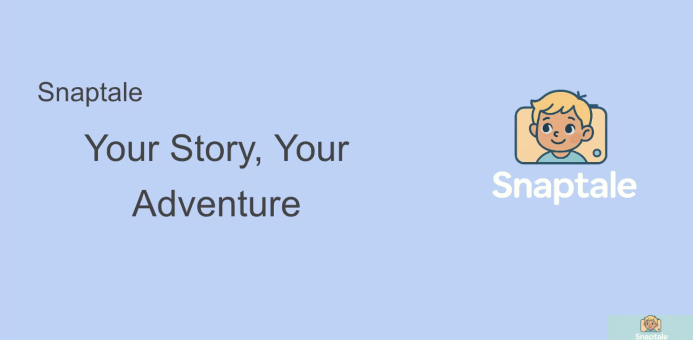

# Snaptale

The app "Snaptale" is an AI-powered personalized storybook generator designed for children. Users upload a photo, ideally featuring a child, and provide a name. The app then uses AI to analyze the photo to identify the main character or a captivating element, and generates a multi-chapter, child-friendly story centered around that character or element. Each chapter includes a unique AI-generated illustration that integrates the main character with the narrative content. The final personalized storybook is assembled into a downloadable PDF, offering an engaging and interactive storytelling experience for young kids.

## Presentation

[](https://www.youtube.com/watch?v=X7HEQr_na9w)

## Current Phase: First Iteration

This is the first phase of the Snaptale application, focusing on core functionality.

- [x] Upload image
- [x] Generate story by uploaded image
- [ ] Category selection
- [ ] Images per chapter
- [ ] New AI Models
- [ ] Lesson Driven Tales


# Snapptale Development Setup Guide

This guide provides instructions to set up the Snapptale development environment.

## Prerequisites

*   Node.js (v18+)
*   Git
*   Docker (for Ollama)

## 1. Initial Setup

### 1.1 Install Node.js and Git

Ensure Node.js (v18+) and Git are installed on your system. You can verify their installation by running:

```bash
node -v
git --version
```

### 1.2 Clone the Repository

Clone the Snaptale repository to your local machine:

```bash
git clone [YOUR_REPOSITORY_URL]
cd snapptale
```
*(Replace `[YOUR_REPOSITORY_URL]` with the actual repository URL)*

### 1.3 Install Dependencies

Navigate to the project root and install the necessary Node.js dependencies:

```bash
npm install
```

## 2. Ollama Setup (Local AI Model)

Snapptale uses Ollama for local AI model inference.

### 2.1 Install Ollama

Follow the instructions on the [Ollama website](https://ollama.ai/download) to install Ollama for your operating system.

### 2.2 Pull the `llava` Model

Once Ollama is installed and running, pull the `llava` model:

```bash
ollama pull llava
```

## 3. Running the Application

### 3.1 Start the Development Server

To start the Next.js development server:

```bash
npm run dev
```
The application will be accessible at `http://localhost:3000`.

### 3.2 Run Tests

To run the test suite:

```bash
npm test
```

### 3.3 Linting

To run the linter:

```bash
npm run lint
```