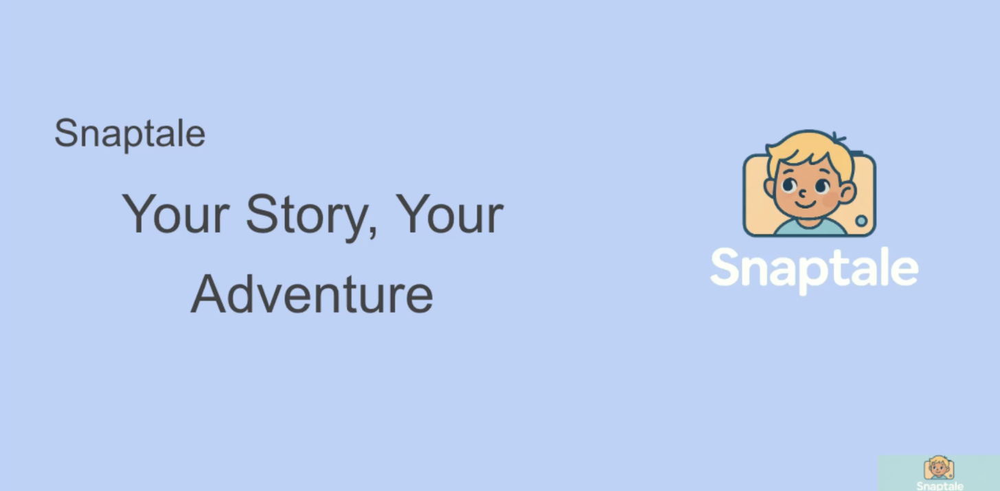

# Snaptale

The app "Snaptale" is an AI-powered personalized storybook generator designed for children. Users upload a photo, ideally featuring a child, and provide a name. The app then uses AI to analyze the photo to identify the main character or a captivating element, and generates a multi-chapter, child-friendly story centered around that character or element. Each chapter includes a unique AI-generated illustration that integrates the main character with the narrative content. The final personalized storybook is assembled into a downloadable PDF, offering an engaging and interactive storytelling experience for young kids.

## Presentation

[](https://www.youtube.com/watch?v=X7HEQr_na9w)

## Current Phase: First Iteration

This is the first phase of the Snaptale application, focusing on core functionality.

- [x] Upload image
- [x] Generate story by uploaded image
- [ ] Category selection
- [ ] Images per chapter
- [ ] New AI Models
- [ ] Lesson Driven Tales


# Snapptale Development Setup Guide

This guide provides instructions to set up the Snapptale development environment.

## Prerequisites

*   Node.js (v18+)
*   Git
*   Docker (for containerized services)

## 1. Initial Setup

### 1.1 Install Node.js and Git

Ensure Node.js (v18+) and Git are installed on your system. You can verify their installation by running:

```bash
node -v
git --version
```

### 1.2 Clone the Repository

Clone the Snaptale repository to your local machine:

```bash
git clone [YOUR_REPOSITORY_URL]
cd snapptale
```
*(Replace `[YOUR_REPOSITORY_URL]` with the actual repository URL)*

### 1.3 Install Dependencies

Navigate to the project root and install the necessary Node.js dependencies:

```bash
npm install
```

## 2. AI Provider Setup

Snapptale supports two AI providers: Ollama (local) and Google AI (cloud). You can choose one or both.

### 2.1 Ollama Setup (Local AI Model)

#### 2.1.1 Install Ollama

Follow the instructions on the [Ollama website](https://ollama.ai/download) to install Ollama for your operating system.

#### 2.1.2 Pull the `llava` Model

Once Ollama is installed and running, pull the `llava` model:

```bash
ollama pull llava
```

#### 2.1.3 Using a Different Ollama Model

By default, the application uses the `llava` model. You can specify a different model by setting the `OLLAMA_MODEL` environment variable. For example, to use `gemma:3b`:

Create a `.env.local` file in the project root:

```
OLLAMA_MODEL=gemma:3b
```

Make sure you have pulled the model you want to use with `ollama pull <model_name>`.

### 2.2 Google AI Setup (Cloud AI Model)

#### 2.2.1 Obtain Google AI API Key

1. Go to [Google AI Studio](https://aistudio.google.com/)
2. Create an account or sign in
3. Generate an API key
4. Copy the API key for use in configuration

#### 2.2.2 Configure Environment Variables

Create a `.env.local` file in the project root with your API key:

```
GOOGLE_API_KEY=your-google-ai-api-key-here
AI_PROVIDER=google
```

Alternatively, you can set these environment variables in your system or Docker configuration.

**Note:** Never commit `.env.local` files containing API keys to version control.

## 3. Running the Application

### 3.1 Start the Development Server

To start the Next.js development server:

```bash
npm run dev
```
The application will be accessible at `http://localhost:3000`.

### 3.2 Run Tests

To run the test suite:

```bash
npm test
```

### 3.3 Linting

To run the linter:

```bash
npm run lint
```

### 3.4 Test Ollama Connection

To test if Ollama is properly configured and accessible:

```bash
npm run test-ollama
```

## 4. Docker Configuration

### 4.1 Using Docker with Ollama

To run the application with Docker and Ollama:

```bash
docker-compose up
```

This will start both the Ollama service and the Next.js application.

### 4.2 Using Docker with Google AI

To use Google AI:

1. Create a `.env.local` file in the project root:
   ```bash
   AI_PROVIDER=google
   GOOGLE_API_KEY=your-google-ai-api-key-here
   ```

2. Start the services:
   ```bash
   docker-compose up
   ```

That's it! Google AI will work with just these steps. The Ollama service will continue to run but will be unused.

**Security Note:** Never commit `.env.local` files containing API keys to version control.

## 5. Switching Between AI Providers

You can switch between AI providers by changing the `AI_PROVIDER` environment variable:

- For Ollama: `AI_PROVIDER=ollama`
- For Google AI: `AI_PROVIDER=google`

The application will automatically use the configured provider for story generation.

## 6. Troubleshooting

If you encounter issues with the Ollama setup, please refer to our [troubleshooting guide](.gemini/troubleshooting-ollama.md) for common issues and solutions.